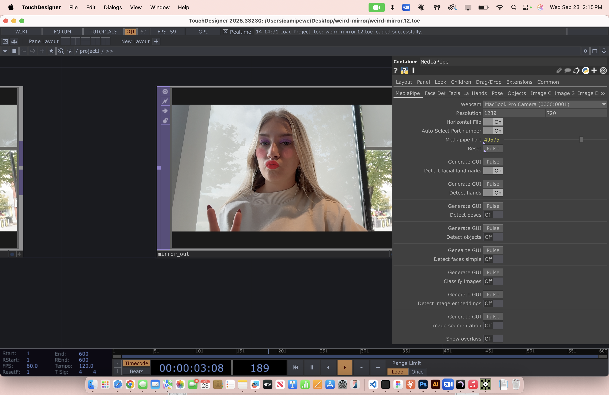

This is my build log

09/09/26: I started this project.

09/14/26: I connected the mcp. This was difficult. This is what Claude said went wrong: uvx wasn't found in VS Code's terminal, Claude Desktop overwrote the config file on quit, fixed by editing with Claude closed and using the full uvx path.

09/20/26: I experiemented with touchdesigner. Attached are the screenshots. 

09/22/26: I built out the first version of my concept. If you touch different areas of your face, it applies makeup. The makeup is nowhere near what I would like it to look like, but the interaction of the viewer touching different areas of their face and it looks like they have makeup on is working.
