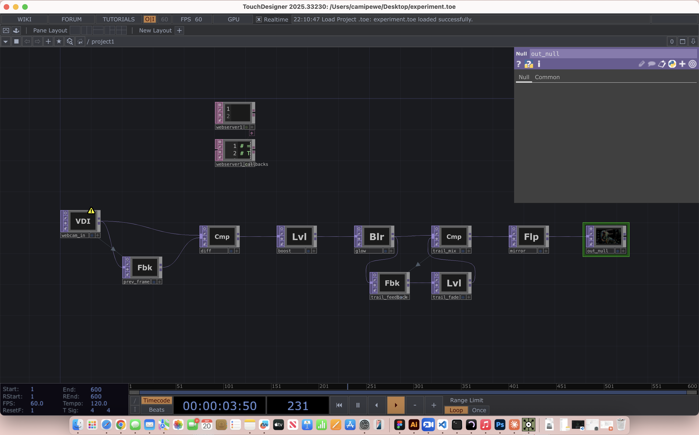
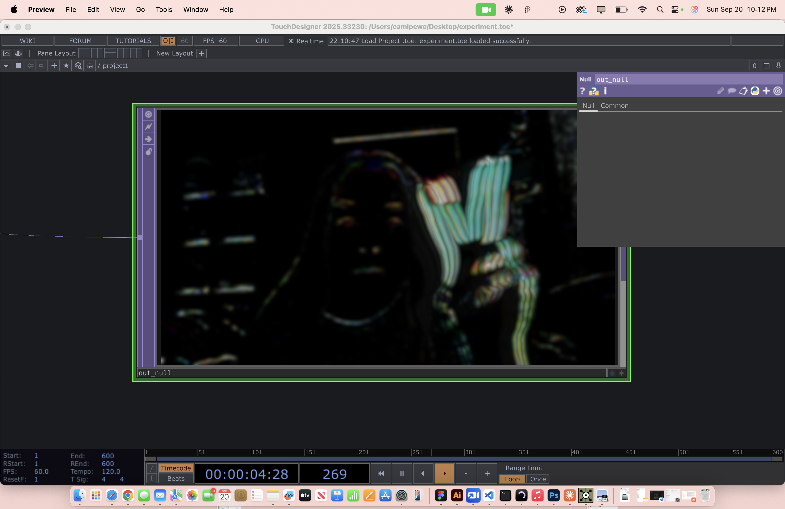
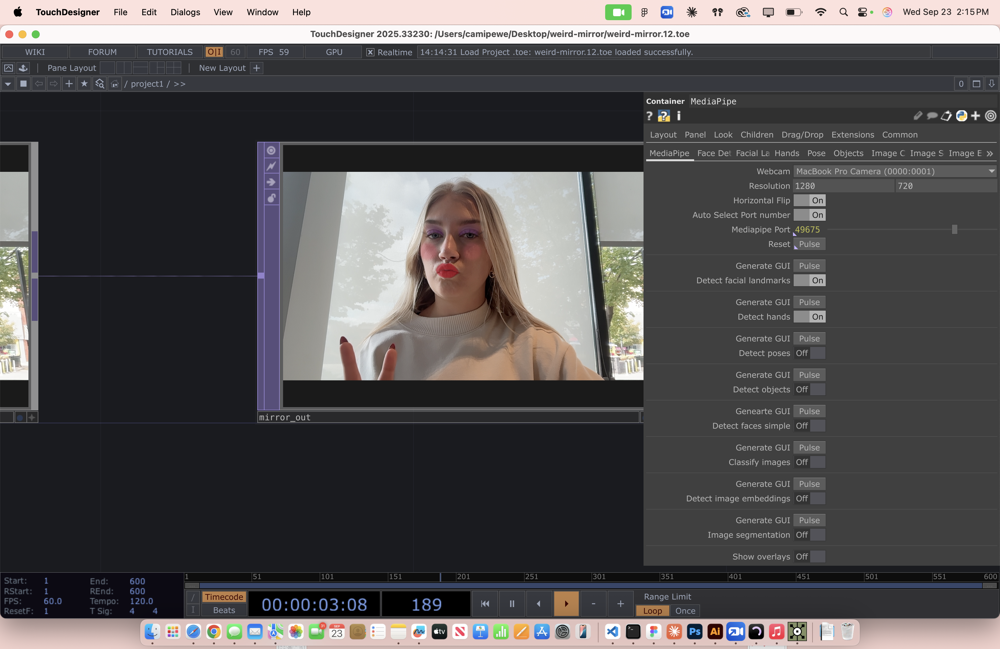
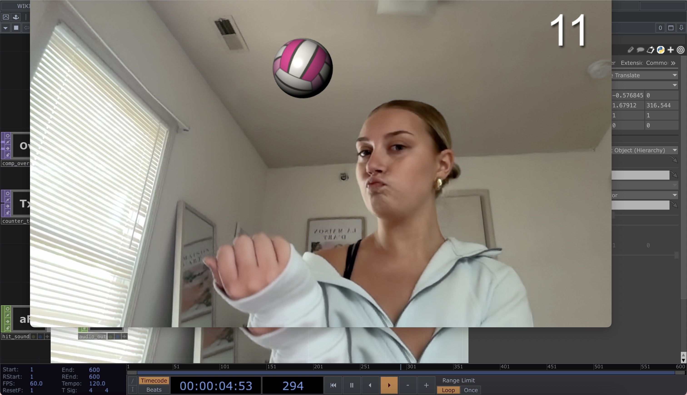

This is my build log

09/09/26: I started this project.

09/14/26: I connected the mcp. This was difficult. This is what Claude said went wrong: uvx wasn't found in VS Code's terminal, Claude Desktop overwrote the config file on quit, fixed by editing with Claude closed and using the full uvx path.

09/20/26: I experiemented with touchdesigner. Attached are the screenshots. 

09/22/26: I built out the first version of my concept. If you touch different areas of your face, it applies makeup. The makeup is nowhere near what I would like it to look like, but the interaction of the viewer touching different areas of their face and it looks like they have makeup on is working.

09/28/26: I kept playing around with the makeup idea, and certain things were frustrating me. For example, the face scanning was very touchy. If I was touching my eyelids to apply "eyeshadow" sometimes it would register as me touching my cheeks and it would apply blush. Which is not how I wanted it to react. Also, the makeup itself looked stupid. I think the vision I had in my head and the output I was being given did not match up at all. Although I wanted it to look silly and not realistic, what Claude was making just looked stupid overall. 

So, I pivoted to my volleyball idea. Right now, a viewer will see themselves on the screen, and then a volleyball will fall from the top of the screen. The viewer can you their hands to keep the ball "alive". I added a counter in the top right corner to keep track of how many "touches" the viewer has, and when the viewer makes contact with the ball there is a sound output. The speed of the ball inscreases after every 10 touches, and after 20 touches, a new ball drops in and the viewer has to keep 2 alive, making the experience a bit more difficult. 

I struggled a lot with getting the ball to only recognize my hands and not anything else. For awhile, it was picking up on my shoulders, my head, and other parts of my body that were not my hands. I have gotten that part like 95% fixed. I also struggled a lot with the physics of the ball. At first, if I made contact with the ball it would fly off of the screen, giving the viewer no sense of control. It is still not acting exactly how I want it to, but it is much better and actually playable now. 

